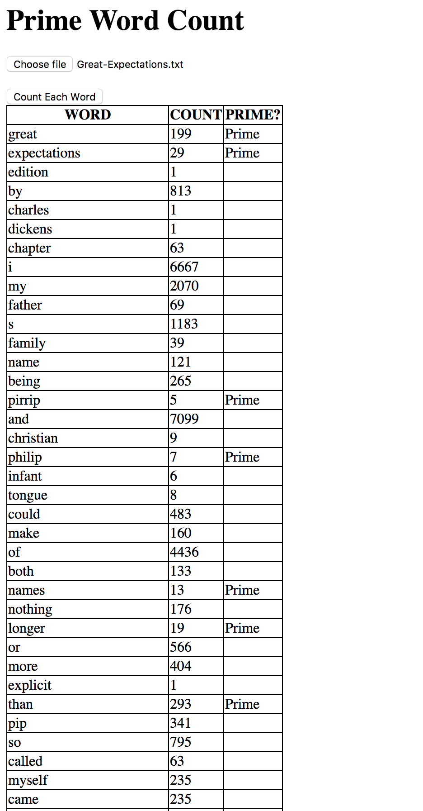

Prime Word Count
================
A simple browser application that takes any text file as input, and outputs a table containing the individual words that appear in it, the number of times a word appears, and if that is a prime number.

Technologies used
----
- Javascript

How to set up and use the application
----
```
$ git clone https://github.com/diaryofdiscoveries/prime-word-count.git
$ cd prime-word-count
$ open index.html
```
- Click 'Choose file' button and select a text file (As examples, find Railway-Children-E-Nesbit.txt and Great-Expectations.txt in this folder).
- Click 'Count Each Word' button to get the table of results for the file.

Tested using:
----
- Jasmine

How to run tests
----
```sh
$ cd prime-word-count
$ open SpecRunner.html
```

How I Approached The Task
----
I started by creating the following user stories:

```
As a user,
So that I can use this app with different text files,
I want to be able to choose any text file to input to the application.

As a user,
So that I can view the file's word count information,
I want to see each word and the number of times it appears (with a note if it is prime number) outputted as a table.
```
I then domain mapped how the application would run, which helped me decide on the **separation of concerns**:

- **Text File Handler** - Responsible for getting the text from the text file.

- **Word Separator** - Responsible for splitting up the text into words.

- **Word Counter** - Responsible for finding unique words and the number of times each of them appears.

- **Prime Notifier** - Responsible for determining if the number of times a given word appears is a prime number.

- **Word Count Viewer** - Responsible for rendering words, word count and prime number verification in a table.

I used the Constructor/Prototype pattern and TDD (unit tests) to guide the process, ensuring functions were encapsulated to help debugging and testing.

For simplicity, I decided to create a browser application, rather than using any frameworks or dependencies, so there are no feature tests.

Note: This application assumes that all clusters of letters in the text file are real words. In the case of using it to analyse the content of book text files, I think this a fair assumption. However, the application could be refined by referencing the clusters of letters against a dictionary to validate them as words.

Screenshot of the Application in Action
----


